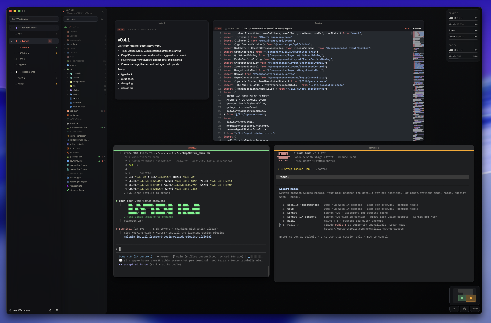

# Korum

Spatial terminal workspace for developers.  
All your terminals. One canvas.

Drag, resize, zoom — organize your workflow spatially instead of switching between tabs.



> **v0.4.2** — early release. macOS only for now.

## Status

Korum is currently in early release. Right now, the focus is stability, persistence, and terminal UX on macOS.

## Features

- **Spatial terminal canvas** — arrange terminals, notes, and code windows on an infinite pan/zoom workspace.
- **Agent-aware workflow** — track Claude Code and Codex activity through terminal status lines, sidebar dots, and minimap indicators.
- **War-room mode** — focus the workspace around active agent sessions when you need a calmer view.
- **Terminal Smart Links** — open URLs and local file paths from terminal output directly into browser or CodeWindows.
- **Code viewer with diffs** — inspect files with Shiki highlighting, inline changes, minimap, and line targeting.
- **Project file tree** — browse workspaces with git status, search, file actions, and active file reveal.
- **Built for large sessions** — keeps 50+ terminals responsive with viewport-aware rendering and staggered attachment.

## Install

Download the latest `.dmg` from [Releases](https://github.com/Quzr27/Korum/releases).

> **macOS Gatekeeper:** The app is not yet signed. On first launch:
> Right-click the app → Open → confirm. Or run:
> ```
> xattr -cr /Applications/Korum.app
> ```

## Quickstart

1. Open Korum and create a workspace (pick a project folder)
2. Double-click the canvas to quickly open a terminal
3. Right-click the canvas for more options (new terminal, note, arrange grid)
4. Press `Cmd+Shift+?` to see all keyboard shortcuts

## Build from source

```bash
bun install
bunx tauri dev       # dev with HMR
bunx tauri build     # release build (.app + .dmg)
```

Requires: [Rust](https://rustup.rs/), [Bun](https://bun.sh/), Xcode Command Line Tools.

## Tech

Tauri 2 · React 19 · TypeScript · xterm.js · portable-pty · Tailwind CSS · shadcn/ui

## Data

All state and settings are stored locally in the macOS Application Support directory.

## License

[MIT](LICENSE)
