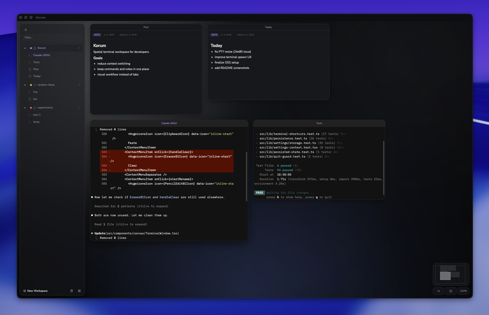
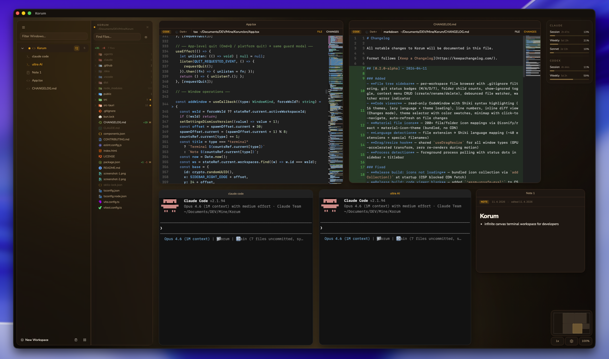

# Korum

Spatial terminal workspace for developers.  
All your terminals. One canvas.

Drag, resize, zoom — organize your workflow spatially instead of switching between tabs.





> **v0.2.1-alpha** — early release. macOS only for now.

## Status

Korum is currently in early alpha. Right now, the focus is stability, persistence, and terminal UX on macOS.

## Features

- Infinite pan & zoom canvas with terminal windows
- Markdown notes alongside terminals
- **File tree sidebar** — per-workspace file browser with .gitignore filtering, git status badges, context menu CRUD
- **Code viewer** — read-only file viewer with Shiki syntax highlighting (16 themes), inline diff view, minimap
- Workspaces backed by project folders or scratch spaces
- Session persistence (positions, sizes, and content survive restarts)
- Built for scale — viewport-aware rendering ensures only visible terminals consume resources
- 25 terminal themes, 5 canvas atmospheres, customizable fonts, font sizes, and zoom speed
- Claude Code & OpenAI Codex usage limits tracking (live OAuth polling)

## Install

Download the latest `.dmg` from [Releases](https://github.com/Quzr27/Korum/releases).

> **macOS Gatekeeper:** The app is not yet signed. On first launch:
> Right-click the app → Open → confirm. Or run:
> ```
> xattr -cr /Applications/Korum.app
> ```

## Quickstart

1. Open Korum and create a workspace (pick a project folder)
2. Double-click the canvas to quickly open a terminal
3. Right-click the canvas for more options (new terminal, note, arrange grid)
4. Press `Cmd+Shift+?` to see all keyboard shortcuts

## Build from source

```bash
bun install
bunx tauri dev       # dev with HMR
bunx tauri build     # release build (.app + .dmg)
```

Requires: [Rust](https://rustup.rs/), [Bun](https://bun.sh/), Xcode Command Line Tools.

## Tech

Tauri 2 · React 19 · TypeScript · xterm.js · portable-pty · Tailwind CSS · shadcn/ui

## Data

All state and settings are stored locally in the macOS Application Support directory.

## License

[MIT](LICENSE)
